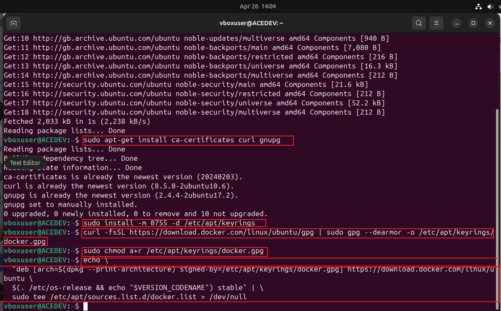
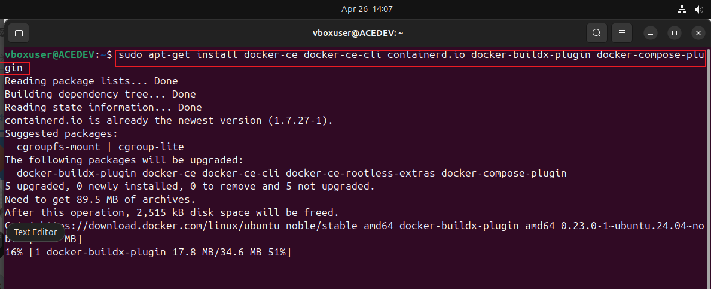
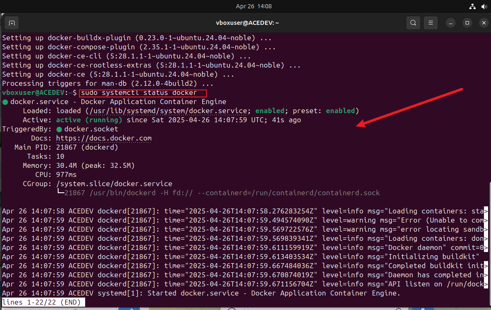
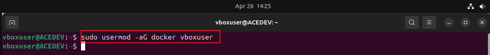
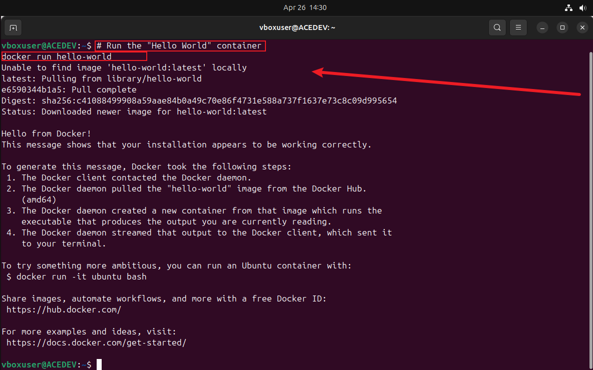
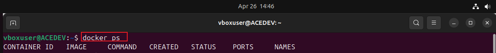
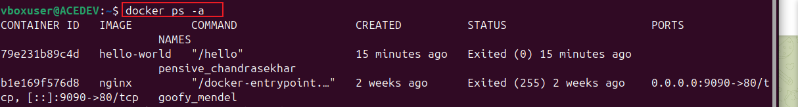
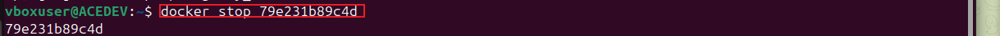
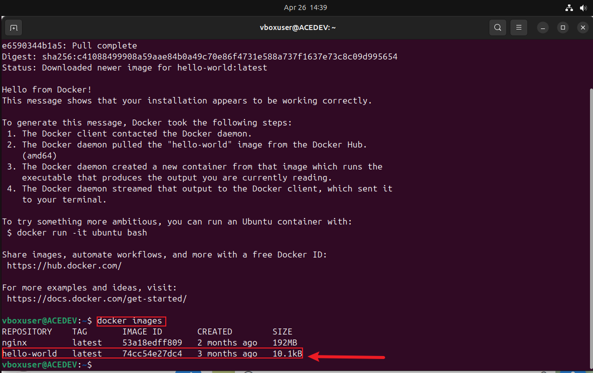
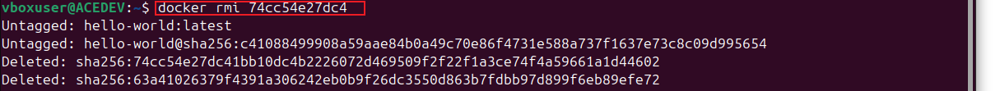

# Docker
Introduction to Docker and Containers

# STEP 1 : installing Docker
* install essential packages including certificate authorities using the transfer tool "curl":
(sudo apt-get install ca-certificates curl gnupg)
* create a directory with specific permission (0755) for storing hey files which are used for docker's authentication:
(sudo install -m 0755 -d /etc/apt/keyrings)
* Download Docker GPG key using "curl" :
(curl -fsSL https://download.docker.com/linux/ubuntu/gpg | sudo gpg --dearmor -o /etc/apt/keyrings/docker.gpg)
* set read permission for all ussers on Docker GPG key file within the APT keyring directory:
(sudo chmod a+r /etc/apt/keyrings/docker.gpg)
* Add the repository to the APT sources:
(echo \"deb [arch=$(dpkg --print-architecture) signed-by=/etc/apt/keyrings/docker.gpg] https://download.docker.com/linux/ubuntu \$(. /etc/os-release && echo "$VERSION_CODENAME") stable" | \
  sudo tee /etc/apt/sources.list.d/docker.list > /dev/null)
  

* installing latest version of Docker:
(sudo apt-get install docker-ce docker-ce-cli containerd.io docker-buildx-plugin docker-compose-plugin)

* verify Docker has be successfully installed:
(sudo systemctl status docker)

* To run Docker commands without superuser priviledges:
(sudo usermod -aG docker ubuntu)

# STEP 2 : Running a container (Hello World)
* using the "docker run" command : # Run the "Hello World" container docker run hello-world.
executing this command Docker performs the following steps:

i. pulls image (if not available locally): it checks for the 'hello world' image locally and if its not found it automatically pulls it from Docker Hub.

ii. A container is created based on the 'hello world' image

iii. it starts the new container and executes the command in 'hello world'

# STEP 3 : Basic Docker commands
* "docker ps" : displays a list of running containers

* "docker ps -a" adding the flag -a lists all containers both running and stopped

* "docker stop" : halts a running container

* "docker pull" it downloads a docker image from a registry to the local machine

* "docker images" it shows all the images

* "docker push" uploads docker images to a registry:

      # Push a local image to Docker Hub
      docker push your-username/image-name

* "docker rmi" removes one or more images from the local machine:

      # Remove a Docker image (replace IMAGE_ID with the actual image ID)
      docker rmi IMAGE_ID

    
    the basic cpmmands like pull, run, list, stop, push and docker images are crucial for effective containerization and ochestration.